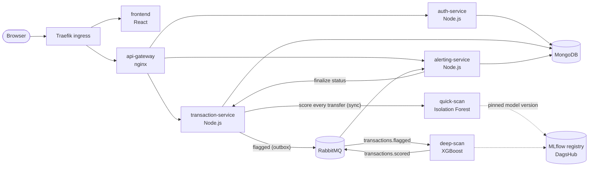
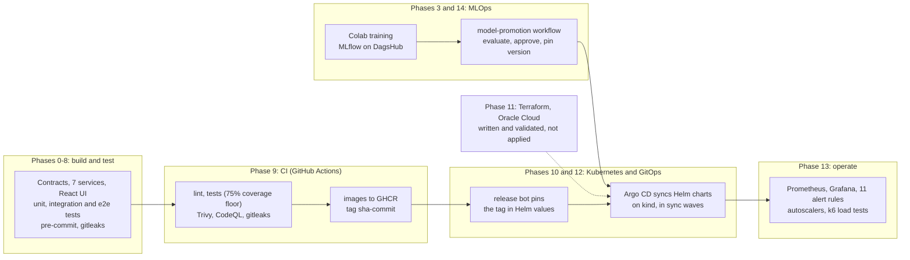
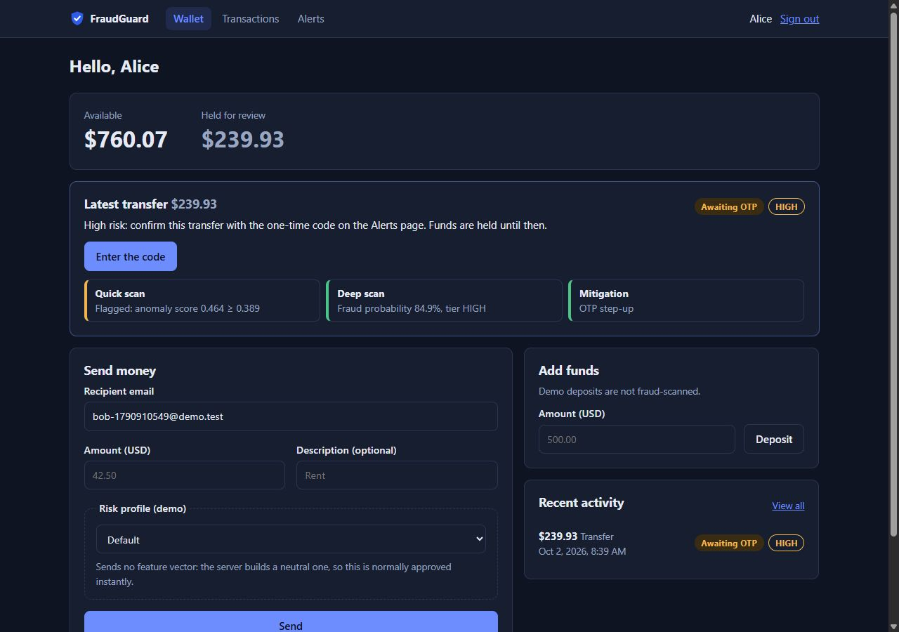
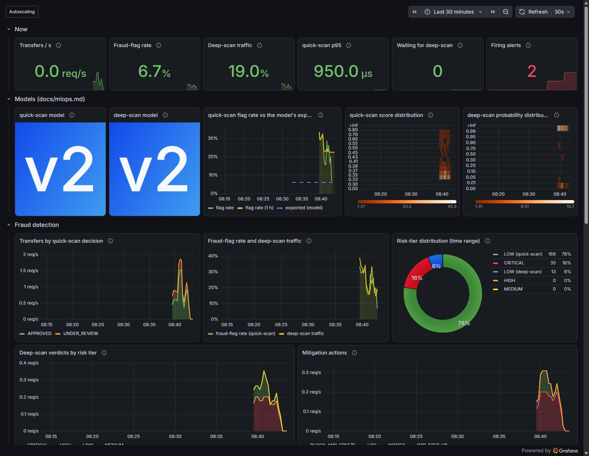
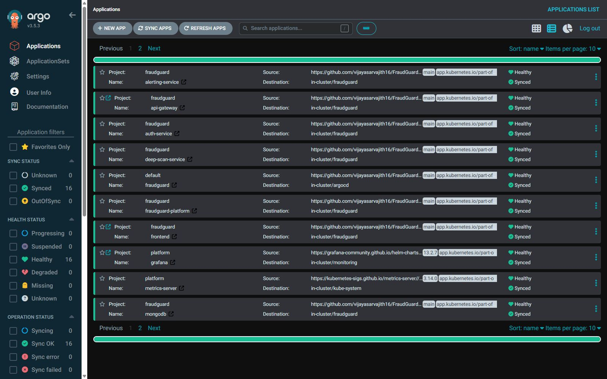
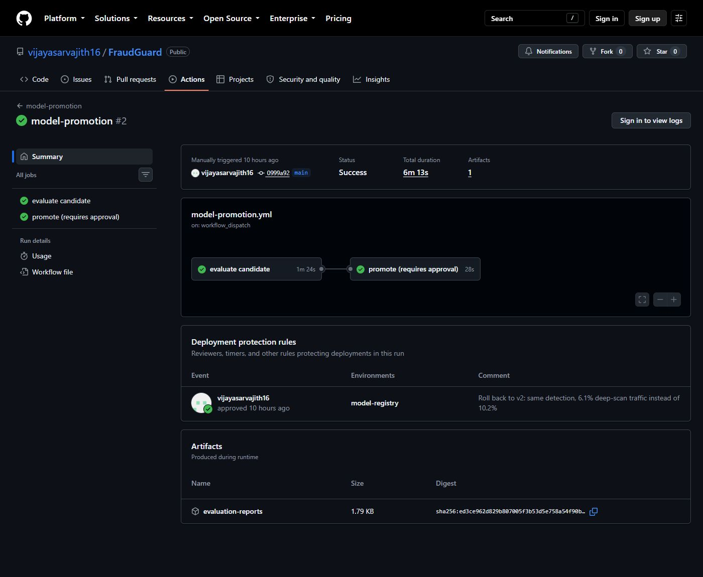

# FraudGuard

FraudGuard is a payment-transfer system that screens every transfer for fraud before money moves.
A fast anomaly model (Isolation Forest) scores every transfer in milliseconds, and the few it finds
suspicious go over RabbitMQ to a stronger model (XGBoost). The resulting risk tier drives an
automatic action: approve, notify, ask for a one-time code, or freeze the account. Around the seven
microservices sits an end-to-end DevOps pipeline: tests and security scans in CI, GitOps on
Kubernetes with Argo CD, Prometheus and Grafana with autoscaling, k6 load tests, and an MLOps loop
that evaluates, approves and rolls out new models. It is a portfolio prototype and runs entirely on
a laptop.

[](docs/ci.md)
[](https://github.com/vijayasarvajith16/FraudGuard/actions/workflows/helm.yml)
[](https://github.com/vijayasarvajith16/FraudGuard/actions/workflows/model-promotion.yml)
[](https://github.com/vijayasarvajith16/FraudGuard/actions/workflows/codeql.yml)

## Results at a glance

| Measure | Result | Source |
|---|---|---|
| Fraud caught (cascade recall, held-out test split) | **77.9%** | [ml-results](docs/ml-results.md) |
| Precision of what the cascade escalates | **93.7%** | [ml-results](docs/ml-results.md) |
| Transfers sent to the expensive model | **6.10%** | [ml-results](docs/ml-results.md) |
| quick-scan scoring latency, p95 inside the service | **≤ 2.5 ms** | [ml-results](docs/ml-results.md) |
| End-to-end load on the laptop cluster | **24 transfers/s, 0 errors, p95 450 ms** | [performance](docs/performance.md) |
| Breaking point | **~28 transfers/s** (MongoDB on one core) | [performance](docs/performance.md) |
| deep-scan outage of 90 s | backlog drained in **35 s**, no client errors | [performance](docs/performance.md) |
| Manual drift reverted by GitOps | within **73 s** | [gitops](docs/gitops.md) |

## Architecture



Seven services, each with `/health`, `/metrics` (Prometheus) and JSON logs; configuration through
environment variables only. Sequence diagrams of a normal, a flagged and a degraded transfer:
[docs/architecture.md](docs/architecture.md). Interfaces: [docs/contracts.md](docs/contracts.md).

## How detection works

1. **quick-scan** (unsupervised Isolation Forest) scores every transfer synchronously, within a
   300 ms budget. Below its threshold the transfer settles at once: `APPROVED`, tier `LOW`.
2. A **flagged** transfer goes `UNDER_REVIEW` with the funds held. An outbox record makes sure its
   event reaches RabbitMQ even if the broker is briefly down.
3. **deep-scan** (supervised XGBoost, early-stopped) turns it into a fraud probability and a tier.
4. **alerting-service** applies the policy in `tierActions.json`, which can be changed without
   redeploying anything:

| Tier | Probability | Action | Result |
|---|---|---|---|
| LOW | < 0.30 | log | approved |
| MEDIUM | 0.30–0.70 | notify the user | approved |
| HIGH | 0.70–0.90 | one-time code (OTP step-up) | waits for the code |
| CRITICAL | ≥ 0.90 | block and freeze the account, open a review case | frozen until an admin decides |

**Fail toward review:** if quick-scan times out or fails, the transfer is treated as flagged and
scored by deep-scan. It is never approved unscored.

On the held-out test split (56,746 transactions, 95 fraud), quick-scan flags 6.10% of traffic and
84.2% of the fraud. The cascade catches 77.9% of all fraud at 93.7% precision, and transactions
stopped by an OTP or a freeze are 97.3% precise. Details, including where the misses are:
[docs/ml-results.md](docs/ml-results.md). Why it is built this way: [ADR 0003](docs/decisions/0003-two-stage-cascade.md),
[ADR 0004](docs/decisions/0004-policy-decoupled-from-models.md), [ADR 0005](docs/decisions/0005-fail-toward-review.md).

## DevOps pipeline



| Area | Tools | Docs |
|---|---|---|
| CI and supply chain | GitHub Actions (reusable workflows, one per service), Trivy, CodeQL, gitleaks, Dependabot, actionlint, zizmor | [ci.md](docs/ci.md) |
| Kubernetes | kind, Helm (one shared service chart), Traefik, Pod Security, autoscaling | [kubernetes.md](docs/kubernetes.md) |
| GitOps | Argo CD app-of-apps, release bot commits | [gitops.md](docs/gitops.md) |
| Infrastructure as code | Terraform (OCI network, VM, k3s bootstrap), Checkov | [terraform.md](docs/terraform.md) |
| Observability | Prometheus, Grafana dashboards as code, promtool tests, metrics-server, prometheus-adapter | [monitoring.md](docs/monitoring.md) |
| Load testing | k6 in the cluster, native histograms over remote write | [performance.md](docs/performance.md) |
| MLOps | MLflow registry, evaluation gates, approval environment, drift alert | [mlops.md](docs/mlops.md) |

## Screenshots

| | |
|---|---|
| <br/>The app: quick-scan flagged this transfer, deep-scan scored it HIGH (84.9%), so the policy asks for a one-time code and holds the funds. | <br/>Grafana during a replay with 20% fraud rows: model versions, flag rate against the model's expectation, score distributions, risk tiers. |
| <br/>Argo CD: all 16 applications deployed from Git, Synced and Healthy. | <br/>GitHub Actions: a model promotion (here the rollback to v2), evaluated, approved in the `model-registry` environment, then rolled out. |

## Quick start (docker compose)

Needs Docker, GNU make and Python 3.12+ (on Windows, run the commands from Git Bash). The scan
services download their models from the public MLflow registry at startup, so an internet
connection is needed.

```bash
git clone https://github.com/vijayasarvajith16/FraudGuard.git
cd FraudGuard
make env    # creates .env with generated secrets (never committed)
make up     # builds and starts 9 containers and waits until all are healthy
```

Then open **http://localhost:8080**, register two users, deposit money and send a transfer. To see
the admin review queue, log in as `ADMIN_EMAIL` with `ADMIN_PASSWORD` from `.env`.

If a port is already taken on your machine, change the `*_HOST_PORT` values in `.env` (the UI is on
`GATEWAY_HOST_PORT`) and run `make up` again. Stop with `make down` (data is kept).

To stream real dataset rows through the system, including fraud, download `creditcard.csv` from
[Kaggle](https://www.kaggle.com/datasets/mlg-ulb/creditcardfraud) to `ml/data/creditcard.csv`, then
run `make replay REPLAY_ARGS="--count 50 --fraud-ratio 0.2"`. It prints a login for one of the demo
users, so you can watch their alerts in the UI.

Tests: `make test` (unit tests, needs Node 22+ as well), `make e2e` (the whole stack through the
gateway). `make help` lists every target.

## Full deployment: Kubernetes with GitOps (local)

Needs kind, kubectl and helm in addition (Windows: `winget install Kubernetes.kind Kubernetes.kubectl Helm.Helm`).

```bash
make env       # if not done yet
make k8s-up    # kind cluster, Traefik, Argo CD; Argo CD then deploys everything from this repository
```

- The app: **http://localhost:8089** (bound to 127.0.0.1). Grafana: **http://localhost:8089/grafana/**
  (`make k8s-grafana` prints the admin password).
- Argo CD UI: `make k8s-argocd`. Prometheus: `make k8s-prometheus`. Status: `make k8s-status`.
- Load test: `make load-rows` once (needs the dataset), then `make load-test`.
- `make k8s-stop` / `make k8s-start` pause and resume the cluster; `make k8s-down` deletes it.

Argo CD follows the `main` branch of this repository and pulls the images CI published to GHCR, so
a merged change reaches the cluster without anyone running kubectl ([docs/gitops.md](docs/gitops.md)).

**Cloud:** `infra/terraform/` describes an Oracle Cloud Always Free environment (network, an Arm VM,
k3s and Argo CD). It is validated in CI (fmt, validate, Trivy, Checkov) but has **never been
applied**: the project is deliberately kept off the internet ([docs/terraform.md](docs/terraform.md)).

## MLOps loop

Train in Colab → register as `candidate` in MLflow → the `model-promotion` workflow evaluates it on
the checksum-verified test split against fixed floors and against production → a human approves →
the version is pinned in Git and Argo CD rolls the scan services → Grafana shows the running version
and a drift alert watches the flag rate. The first real promotion showed why each step exists: a
model with no gain that raised deep-scan traffic from 6.1% to 10.2% was rolled back through the
same path, and the rules now reject such a model. [docs/mlops.md](docs/mlops.md)

## Testing

| Layer | Command | What it proves |
|---|---|---|
| Unit | `make test` | Each service's logic: validation, state machine, money movements, scoring, UI components. |
| Queue integration | `make test-integration` | Real RabbitMQ: confirms, retries, dead-lettering, redelivery. |
| Gateway black box | `make gateway-test` | Routing, deny list, CORS, rate limits, error envelopes. |
| End to end | `make e2e` | The whole stack through the gateway, including fraud tiers, OTP, freeze and review, and quick-scan or deep-scan outages. |
| Monitoring as code | `make test-monitoring` | Every alert rule unit-tested with promtool; every dashboard query parses. |
| Load | `make load-test` | Throughput, latency and autoscaling on the cluster. |

Every pull request also runs the end-to-end suite in CI ([docs/testing.md](docs/testing.md)).

## Repository layout

```
services/       auth, transaction, alerting (Node.js); quick-scan, deep-scan (Python); api-gateway (nginx)
frontend/       React UI
ml/             training, evaluation and promotion scripts, Colab notebook
infra/          helm/ (charts), kind/, argocd/, monitoring/, terraform/
tests/          e2e/, load/ (k6), monitoring/ (promtool)
tools/          dataset replay and demo-sample tools
docs/           everything below
```

## Documentation

| Doc | Contents |
|---|---|
| [architecture.md](docs/architecture.md) | Components, sequence diagrams, reliability patterns, deployment view |
| [contracts.md](docs/contracts.md) | APIs, events, queues, model loading, tiers and policy (authoritative) |
| [decisions/](docs/decisions/) | Architecture decision records |
| [ml-results.md](docs/ml-results.md) | Model metrics and how they were measured |
| [mlops.md](docs/mlops.md) | The model lifecycle: train, evaluate, approve, promote, monitor |
| [testing.md](docs/testing.md), [ci.md](docs/ci.md) | Test layers and the CI pipelines |
| [kubernetes.md](docs/kubernetes.md), [gitops.md](docs/gitops.md), [terraform.md](docs/terraform.md) | Deployment |
| [monitoring.md](docs/monitoring.md), [performance.md](docs/performance.md) | Observability and load-test results |
| [resume.md](docs/resume.md) | Resume bullets and a 30-second explanation |

## Limitations

- **Prototype scope.** Built to demonstrate engineering practice, not to process real payments. No
  compliance certification (PCI DSS, SOC 2 or similar), no real money, and notifications and OTP
  codes are simulated (shown in the app instead of sent by SMS or email).
- **Public, anonymized dataset.** The Kaggle Credit Card Fraud dataset has PCA-transformed features
  (V1–V28); only `Time` and `Amount` have a real-world meaning. The models have never seen live
  traffic, and their results are from one historical dataset.
- **Demo-scale load.** About 28 transfers/s on a laptop, with MongoDB on one core; overload is not
  yet shed gracefully ([performance.md](docs/performance.md) lists the follow-ups).
- **Local only.** Everything runs on one machine; the cloud Terraform has never been applied. Data
  stores run as single replicas, and secrets come from a local `.env` rather than a secret manager.
