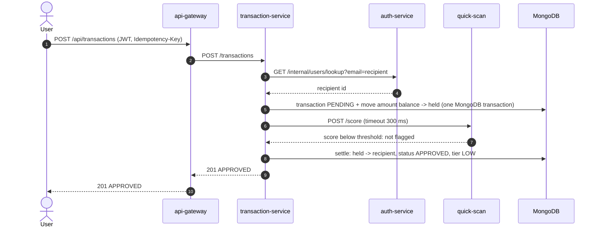
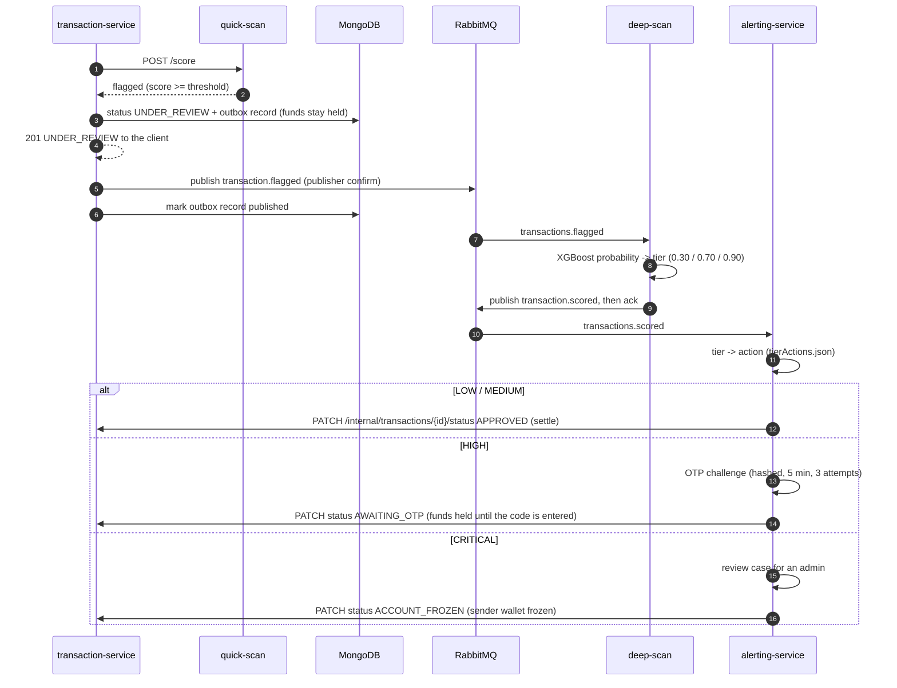
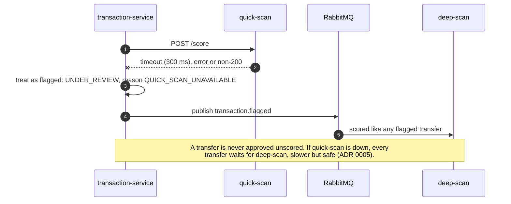

# Architecture

FraudGuard is a small payment system whose every transfer is screened by a two-stage fraud cascade.
This page shows the parts and how a transfer moves through them. The authoritative interface
definitions are in [contracts.md](contracts.md); the design decisions in [decisions/](decisions/).

## Components

| Component | Tech | Port | Owns | Role |
|---|---|---|---|---|
| frontend | React (Vite), served by nginx | 8081 | - | Wallet, transfer form, live status of the last transfer, alerts, admin review queue. |
| api-gateway | nginx | 8080 | - | The only public entry: routes `/api/*`, rate limits per client IP, CORS, security headers, JSON error envelopes; hides `/internal` routes and the scan services. |
| auth-service | Node.js, Express | 3001 | users (MongoDB) | Registration, login (bcrypt, JWT), the internal user lookup. |
| transaction-service | Node.js, Express | 3002 | wallets, transactions, idempotency keys, outbox (MongoDB) | Transfers and the money state machine; calls quick-scan synchronously; publishes flagged transfers. |
| quick-scan-service | Python, FastAPI, Isolation Forest | 8001 | - | Scores **every** transfer in ~1 ms; flags the anomalous ~6%. |
| deep-scan-service | Python, FastAPI, XGBoost, RabbitMQ consumer | 8002 | - | Scores only flagged transfers; its probability sets the risk tier. |
| alerting-service | Node.js, Express, RabbitMQ consumer | 3003 | alerts, OTP challenges, review cases (MongoDB) | Maps the tier to an action (log, notify, OTP step-up, freeze) from a hot-reloaded policy file, and finalizes the transfer. |
| MongoDB | single-node replica set | 27017 | | Multi-document transactions for money movements. |
| RabbitMQ | quorum queues | 5672 | | `transactions.flagged` and `transactions.scored`, each with retry and dead-letter queues. |
| MLflow (DagsHub) | external registry | | models | The scan services download their pinned model version at startup. |

Every service exposes `GET /health` (readiness), `GET /health/live` and `GET /metrics` (Prometheus),
logs JSON and is configured only through environment variables.

## A normal transfer (about 94% of traffic)



## A flagged transfer (about 6%)



The client polls `GET /api/transactions/{id}` and sees the transfer settle, ask for a code or freeze
within a second or two (docs/performance.md measures the time to verdict).

## When quick-scan is unavailable: fail toward review



## Reliability patterns

| Pattern | Where | Contract |
|---|---|---|
| Transactional outbox: the event is written with the status change, published with publisher confirms, and republished by a relay if the broker was down | transaction-service | §2.3, §3.3 |
| Recovery of interrupted transfers: `PENDING` for more than 30 s moves to review, never to approval | transaction-service relay | §2.3 |
| Idempotency keys on transfers (24 h), and per-event deduplication in the consumers | transaction-service, deep-scan, alerting | §2.3, §3.5 |
| Retry queues with backoff, then a dead-letter queue | both consumers | §3 |
| Guarded state machine: only listed transitions, each with its money effect, inside MongoDB transactions | transaction-service | §2.3 |
| Models load a pinned registry version and refuse to start on any mismatch | scan services | §4.1 |
| Policy reloads without restarts; an invalid file keeps the last good policy | alerting-service | §6.2 |

## Deployment view

```
kind cluster "fraudguard" (127.0.0.1:8089)
├── traefik       ingress: /api -> api-gateway, / -> frontend, /grafana -> Grafana
├── argocd        app-of-apps following main: sync waves -2 projects, -1 namespaces,
│                 0 data stores and monitoring, 1 services, 2 gateway and frontend
├── fraudguard    the 7 services, MongoDB, RabbitMQ; autoscalers for transaction-service and
│                 quick-scan (CPU) and deep-scan (queue depth)
├── monitoring    Prometheus, Grafana, kube-state-metrics, prometheus-adapter
└── kube-system   metrics-server
```

Images are built and scanned by GitHub Actions, published to GHCR, and pinned in Git by a release
commit; Argo CD rolls them out ([gitops.md](gitops.md)). Model versions are pinned the same way by
the promotion workflow ([mlops.md](mlops.md)).
