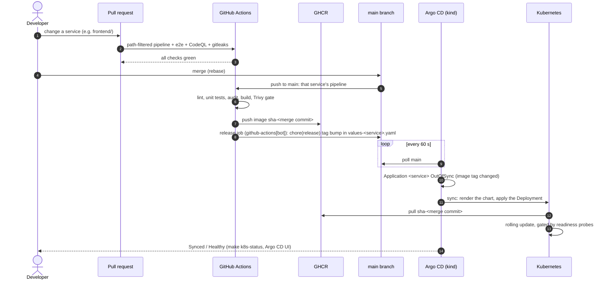

# GitOps: how a change reaches the cluster

Git is the single source of truth for what runs. CI builds and publishes images and records the
new image tag in Git; Argo CD, inside the cluster, makes the cluster match Git. Nobody runs
`kubectl apply` or `helm upgrade` to deploy.

The cluster is the local kind cluster (docs/kubernetes.md). Argo CD **pulls** from the public GitHub
repository every 60 seconds, so nothing on the machine needs to be reachable from the internet.

## Promotion flow

Only the service that changed is rebuilt, retagged and rolled out: the pipelines are path-filtered
(docs/ci.md), and Argo CD applies only the Application whose values file changed.

## The pieces

| Piece | Where | What it does |
|---|---|---|
| Image pipeline | `.github/workflows/_container-image.yml` | On a push to `main`: pushes `sha-<commit>` to GHCR, then the `release` job commits the tag into `infra/helm/values/values-<service>.yaml`. |
| Root application | `infra/argocd/root.yaml` | Applied once by `make k8s-up`; renders the app-of-apps from Git. |
| App-of-apps | `infra/argocd/apps/` | The `fraudguard` AppProject and one Application per component, each following `targetRevision`. |
| Service charts | `infra/helm/` | What each Application renders: the shared service chart plus MongoDB and RabbitMQ. |
| Argo CD settings | `infra/argocd/install/argocd-cm.yaml` | 60 s polling; Application health, so sync waves wait. |

### The release commit

- Runs only after a successful image push from `main`, with `contents: write` for that job alone.
- Commits as `github-actions[bot]`: `chore(release): <service> sha-xxxxxxx`. Commits made with the
  workflow token do not start other workflows, so a release cannot trigger itself.
- **Races:** when several services release at once, a rejected push fetches, rebases and retries.
- **Never backwards:** if the tag in Git already points to a newer commit (a slower, older build
  finishing last), the job does nothing.
- Branch protection: if `main` later requires pull requests, allow `github-actions[bot]` to bypass
  the rule, or the release commit is rejected.

### Sync behaviour

| Setting | Effect |
|---|---|
| `automated` | Applies changes from Git without a manual sync. |
| `prune: true` | Resources removed from Git are deleted from the cluster. |
| `selfHeal: true` | Manual changes in the cluster (`kubectl scale`, `edit`, `delete`) are reverted to Git within about a minute (measured: a scale to 3 replicas was undone after 69 s; a deleted Deployment was recreated after 73 s). |
| Sync waves | -1 namespace → 0 MongoDB, RabbitMQ → 1 backend services → 2 gateway, frontend. Each wave waits until the previous one is healthy. |
| Finalizers | Deleting an Application deletes what it deployed. |

## Day-2 operations

| Task | How |
|---|---|
| Deploy a change | Merge a PR. Nothing else. |
| Roll back a service | `git revert` its `chore(release)` commit (or set an older `sha-` tag in its values file) and merge. Argo CD rolls back the same way it rolls forward. |
| Change configuration | Edit `infra/helm/values/values-<service>.yaml` (env, resources, the alerting tier policy) and merge. Env changes roll the pods; the tier policy is reloaded in place (docs/kubernetes.md). |
| See status | `make k8s-status`, or `make k8s-argocd` for the UI (https://localhost:8443, user `admin`). |
| Test a branch before merging | `ARGOCD_REVISION=<branch> make k8s-up`: the whole tree follows that branch. Run `make k8s-up` again to return to `main`. |
| Deploy unpublished local builds | `make k8s-down` then `K8S_LOCAL_IMAGES=1 make k8s-up` (direct Helm, no Argo CD). |

## Limitations (deliberate, local demo)

- **Secrets are not in Git.** `make k8s-up` creates `fraudguard-secrets` from `.env`; the charts only
  reference it. A shared environment would use Sealed Secrets or the External Secrets Operator so the
  Secret is also declared in Git.
- **Polling, not webhooks.** Rollouts start within about a minute of the release commit. Webhooks
  would need the cluster reachable from GitHub, which a local-only setup avoids.
- **One environment.** Promotion is `main` → this cluster. A staging/production split would add a
  values file per environment and promote by pull request between them.
